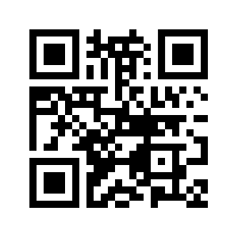
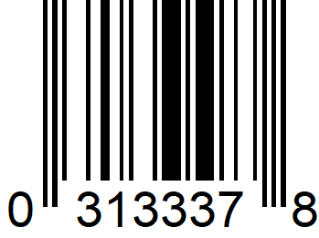
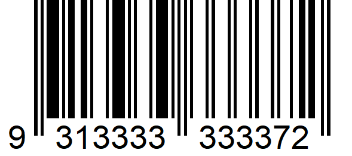
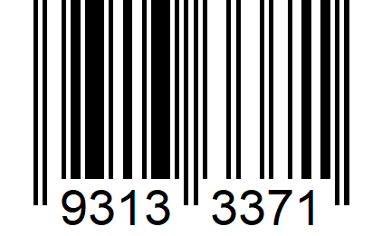
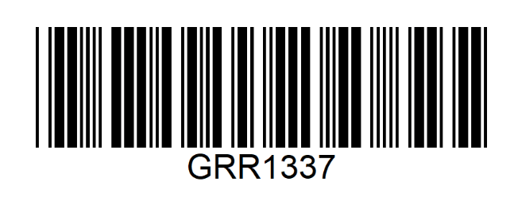

# codes

 | **QR Code**   `https://github.com/atrinh0`
--- | ---

     

 | **Universal Product Code (UPC-E)**   `03133378`
--- | ---

     

 | **EAN-13 (including UPC-A)**   `9313333333372`
--- | ---

     

 | **EAN-8**   `93133371`
--- | ---

     

 | **Code 39**   `GRR1337`
--- | ---

     

Code 93
Code 128
PDF417
Aztec Code
Interleaved 2 of 5
ITF14
DataMatrix
