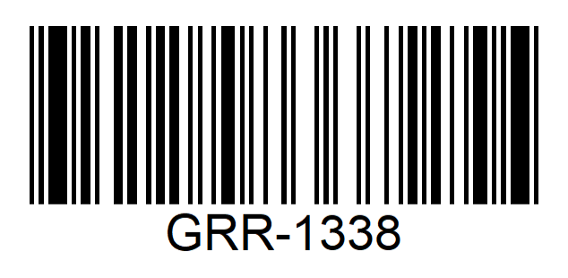
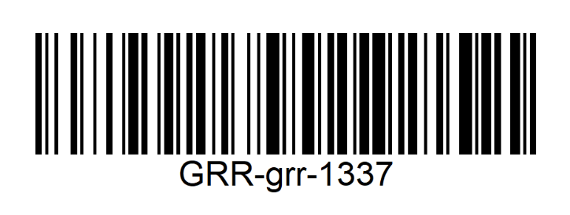
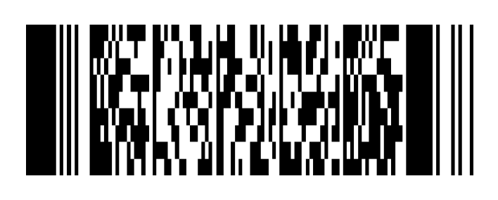
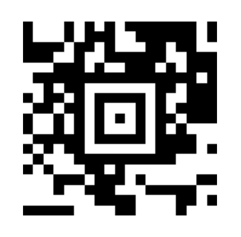
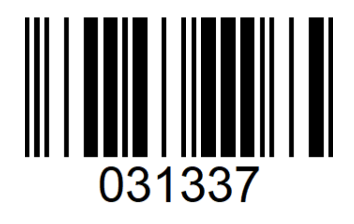
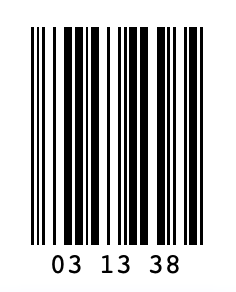
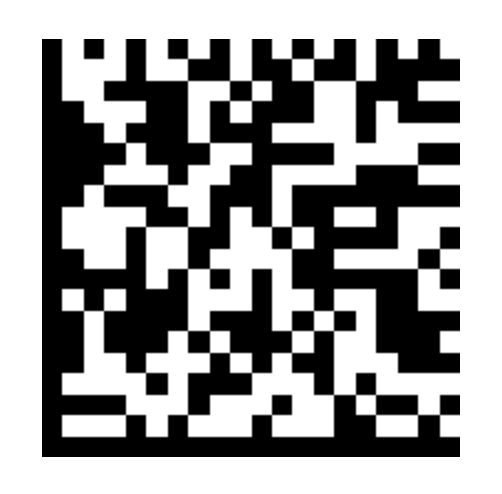

# codes

 | **QR Code**   `https://github.com/atrinh0`
--- | ---

       

 | **Universal Product Code (UPC-E)**   `03133378`
--- | ---

       

 | **EAN-13 (including UPC-A)**   `9313333333372`
--- | ---

       

 | **EAN-8**   `93133371`
--- | ---

       

 | **Code 39**   `GRR1337`
--- | ---

       

 | **Code 93**   `GRR-1338`
--- | ---

       

 | **Code 128**   `GRR-grr-1337`
--- | ---

       

 | **PDF417**   `Stay Hungry. Stay Foolish.`
--- | ---

       

 | **Aztec Code**   `There is no spoon`
--- | ---

       

 | **Interleaved 2 of 5**   `031337`
--- | ---

       

 | **ITF14**   `031338`
--- | ---

       

 | **DataMatrix**   `All your base are belong to us`
--- | ---

